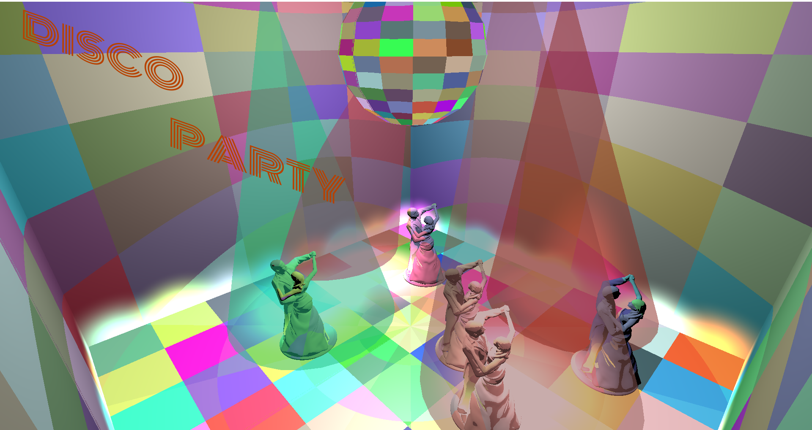

<!--- insert project logo here -->

<!--- general description of the project -->
This project is the third student assignment for the Computer Graphics course. It is a simple game that incorporates **different
lighting** and **texturing techniques**. The project is build upon the following [framework](https://github.com/UPB-Graphics/gfx-framework) and it follows the following assignment [specifications](https://ocw.cs.pub.ro/courses/egc/teme/2021/03) with some **additional twists**.

## :trophy: Features
  &nbsp;&nbsp; :small_orange_diamond: Multiple light sources (static and dynamic)  
  &nbsp;&nbsp; :small_orange_diamond: Emissive floor lighting  
  &nbsp;&nbsp; :small_orange_diamond: Reflectors spot lighting  
  &nbsp;&nbsp; :small_orange_diamond: Disco Ball point lighting  
  &nbsp;&nbsp; :small_orange_diamond: Disco Ball spherical environment mapping   
  
## :white_check_mark: Prerequisites

## :hammer: Building
Open a terminal and go into the root folder of the project, which contains the top-level `CMakeLists.txt` file.
Do not run CMake directly from the top-level folder (meaning, do not do this: `cmake .`). Instead, make a separate directory, as follows:

1.  `mkdir build`
2.  `cd build`
3.  `cmake .. -DWITH_LAB_M1=1 -DWITH_LAB_M2=0 -DWITH_LAB_EXTRA=0`
4.  Build the project:
    -   Windows, one of the following:
        -   `cmake --build .`
        -   or just double-click the `.sln` file to open it in Visual Studio, then press `Ctrl+Shift+B` to build it
    -   Linux and macOS, one of the following:
        -   `cmake --build .`
        -   or just `make`

That's it! :tada:

## :running: Running
You can run the project from an IDE, as well as standalone, from anywhere on disk. For example:

-   Windows, one of the following:
    -   `.\bin\Debug\GFXFramework`
    -   or just open the `.sln` file in Visual Studio, then press `F5` to run it

-   Linux and macOS:
    -   `./bin/Debug/GFXFramework`

## :page_facing_up: License
This project is available under the [MIT][ref-mit] license; see [LICENSE](LICENSE) for the full license text.
This project also includes external libraries that are available under a variety of licenses; see [LEGAL.txt](LEGAL.txt)
for the full license texts and legal notices.

<!--- add link references here -->
[ref-cmake]:            https://github.com/Kitware/CMake/
[ref-cmake-dl]:         https://github.com/Kitware/CMake/releases/
[ref-cmake-build]:      https://github.com/Kitware/CMake#building-cmake-from-scratch
[ref-mit]:              https://opensource.org/licenses/MIT
