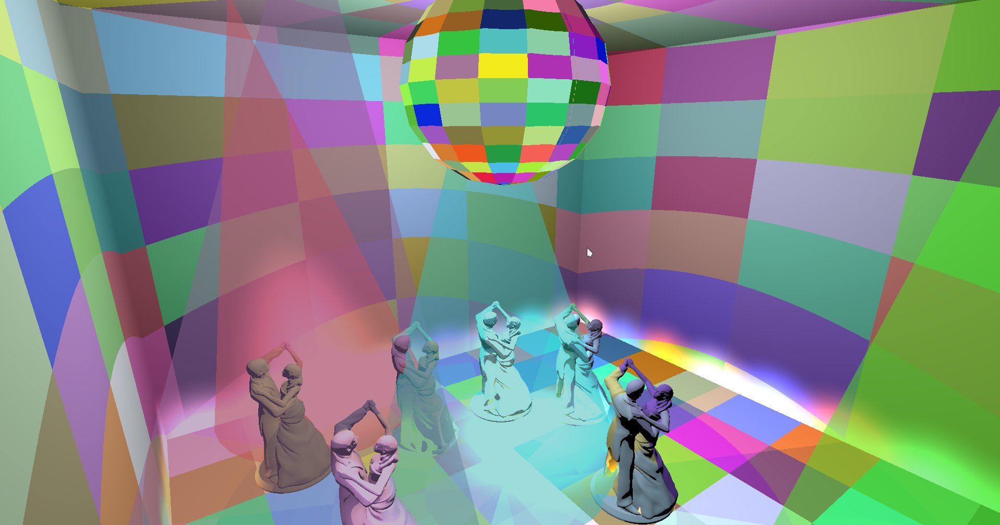

# Disco Party

## Description

This project is the third student assignment  for the Computer Graphics Elements course. It is a simple game that incorporates different
lighting and texturing techniques. The project is built upon the following framework:

  ### :trophy: Features
  &nbsp;&nbsp; :small_blue_diamond: fsdf  
  &nbsp;&nbsp; :small_blue_diamond: gdg  
  &nbsp;&nbsp; :small_blue_diamond: rgeg  
  &nbsp;&nbsp; :small_blue_diamond: sgs   
  &nbsp;&nbsp; :small_blue_diamond: afasgw    

## :gear: Building
Available [here](https://github.com/UPB-Graphics/gfx-framework).

## :page_facing_up: License

This project is available under the [MIT][ref-mit] license; see [LICENSE.md](LICENSE.md) for the full license text.
This project also includes external libraries that are available under a variety of licenses; see [LEGAL.txt](LEGAL.txt)
for the full license texts and legal notices.

[ref-cmake]:            https://github.com/Kitware/CMake/
[ref-cmake-dl]:         https://github.com/Kitware/CMake/releases/
[ref-cmake-build]:      https://github.com/Kitware/CMake#building-cmake-from-scratch
[ref-mit]:              https://opensource.org/licenses/MIT
